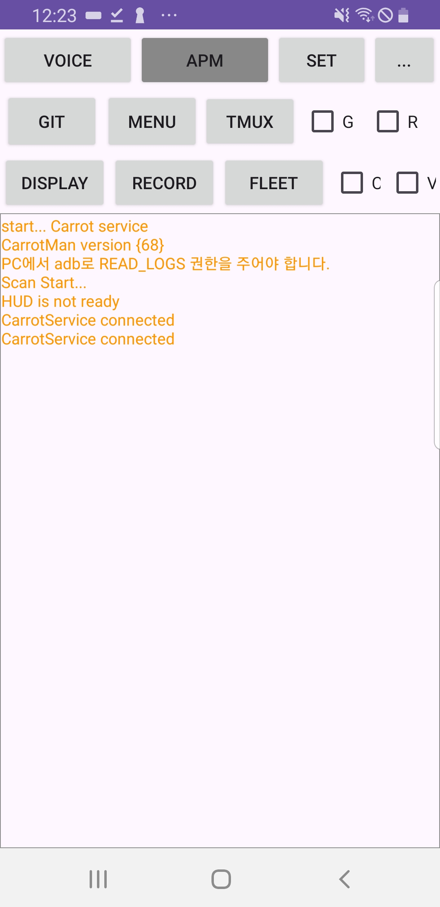

# 기본 설명

## <mark style="background-color:red;">모든 기능은 콤마와 안드로이드 기기가 같은 네트워크에 있을 때 작동합니다.</mark>

## VOICE (Voice On Openpilot)

* &#x20;지원 음성 명령
  * 속도 올려
  * 속도 내려
  * 우측차로, 오른쪽 차로, 우측 차선, 오른쪽 차선
  * 좌측차로, 왼쪽 차로, 좌측 차선, 왼쪽 차선
  * 크루즈 켜, 롱컨 켜, 크루즈 온, 롱컨 온
  * 크루즈 꺼, 롱컨 꺼, 크루즈 오프, 롱컨 오프&#x20;
  * 속도 100키로, 속도 90키로, ..., 속도 20키로&#x20;
  * 출발출발, 가자가자, 렛츠고, 이제가자, 달려달려&#x20;
  * 그만가자, 스톱스톱, 정지정지 (속도만 줄입니다)

## APM

* 당근맨이 당근네비의 경로 데이터를 콤마에 정상적으로 전송하고 있을 때 초록색으로 NAVI 라고 표시됩니다.
* 해당 위치의 버튼을 클릭하면 APM Service를 재시작합니다.

## SET

* 콤마의 설정으로 진입합니다.
* 콤마의 모든 설정을 변경할 수 있습니다.

## GIT

* [SSH 키 설정](../basic-settings/ssh.md#ssh-1), 브랜치 변경, 깃풀 등 SSH에서 GIT을 이용해 해야하는 작업을 당근맨에서 할 수 있습니다.
  *   Git Select Branch

      * 브랜치를 변경할 수 있습니다.
      * 일종의 버전 변경이라고 생각하면 쉽습니다.
        * **새로 생긴 브랜치가 안보이는 경우에는** Git Select Branch를 누른 후 잠시 기다린 후, 다시 Git Select Branch를 누르면 표시됩니다.
      * <mark style="background-color:purple;">브랜치를 변경한 후에는 꼭, 콤마를 재부팅 해야합니다.</mark>

  * Git Pull
    * 해당 브랜치에서 변경사항을 적용합니다.
    * 일종의 업데이트라고 생각하면 쉽습니다.
    * <mark style="background-color:purple;">깃풀 후에는 꼭, 콤마를 재부팅 해야합니다.</mark>
  * Rubuild All
    * 전체를 리빌드 합니다.
    * 리빌드 후, 콤마를 리붓합니다. **10분 이상 소요됩니다.**

## MENU

* Send Tmux log
  * Tmux log를 당근서버에 전송합니다.
  * 차량의 에러는 포함하지 않습니다.
  * 콤마의 로그나 에러를 포함합니다.
* Delete all videos
  * 콤마의 로컬에 있는 녹화 영상을 모두 제거합니다.
* Install Flask
  * 아그노스 업데이트로 인해 FLEET에 접속이 안되는 경우 사용합니다.
  * <mark style="background-color:purple;">Flask 설치 후, 콤마를 재부팅 해야합니다.</mark>
* Scan
  * 콤마를 스캔합니다.
* Reboot
  * 콤마를 재부팅합니다.

## TMUX

* tmux 로그를 볼 수 있습니다.
* 차량 에러는 포함하지 않습니다.
* 콤마의 로그와 에러를 포함합니다.

## RECORD

* 콤마의 화면을 녹화/녹화중지 합니다.

## FLEET

* FLEET으로 바로 접속합니다.

## G, R, C, V

* G, R&#x20;
  * 경로 전송 관련 기능
* C
  * 당근캠 (휴대폰의 카메라로 신호등 인식)을 자동 활성화 합니다.
* V
  * VOO(Voice On Openpilot)을 자동 활성화 합니다.

<figure><figcaption></figcaption></figure>
