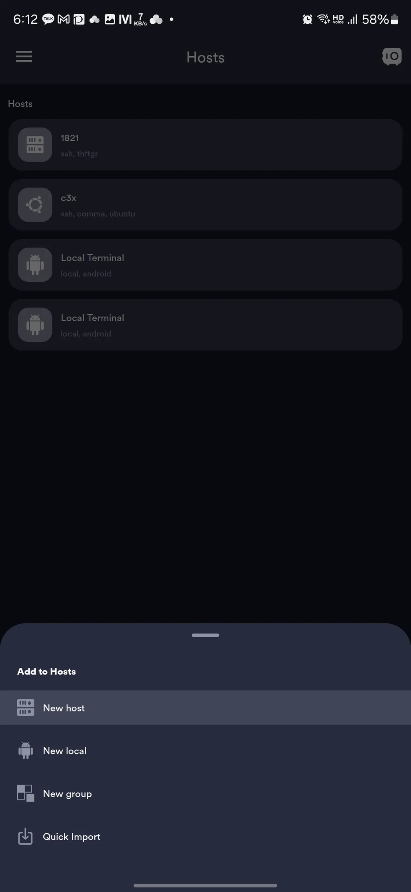
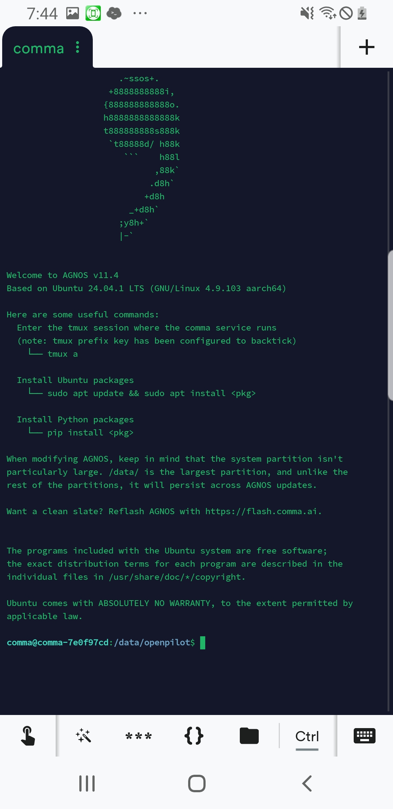

# SSH 접속 ( 휴대폰으로 )

## 조건

* <mark style="background-color:purple;">ssh를 이용하기 위해서는</mark> <mark style="background-color:purple;"></mark><mark style="background-color:purple;">**콤마와 휴대폰이 같은 네트워크 상**</mark><mark style="background-color:purple;">에 있어야 합니다!</mark>

## 앱 다운로드

* Termius 앱을 이용합니다.
* [https://play.google.com/store/apps/details?id=com.server.auditor.ssh.client\&pcampaignid=web\_share](https://play.google.com/store/apps/details?id=com.server.auditor.ssh.client\&pcampaignid=web_share)

## 호스트 추가

* 우측 하단 + 버튼 클릭
*   New host 버튼 클릭

    <figure><figcaption>
+ 버튼을 누른 후 사진
</figcaption></figure>

*   값 입력

    * Alias : 원하는 이름 ( 예 : c3x )
    * Hostname or IP Address : 콤마 화면상 우측 하단 ip ( 예 : 192.168.37.214 )
    * Username : comma

    *   Key 옆의 열쇠 모양 클릭

        * 우측 하단 + 모양 클릭
        * New SSH Key 클릭
        * Import from file 클릭
        * ssh key 개인 파일 선택  ( <mark style="background-color:red;">id\_rsa.pub 말고,</mark>   <mark style="background-color:blue;">id\_rsa !!</mark> )

        
<figure><figcaption>
ssh 키 파일 선택 후
</figcaption></figure>

        *   우측 상단 체크 모양 선택 후 저장

* 메인 화면에서 추가된 host를 클릭하면 ssh 접속이 됨.

<figure><figcaption>
ssh 내부
</figcaption></figure>

## 콤마의 아이피가 변경되었을 때

* 메인 화면의 호스트를 길게 누르고, 하단의 연필모양을 눌러 수정 모드로 진입.
* ip 부분을 새로운 콤마의 ip로 변경 후 저장

## 정보 & 자료 제공

thanks to thftgr
