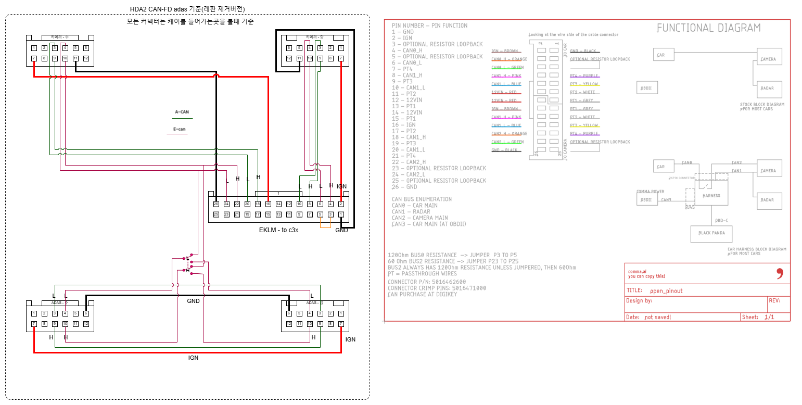

# HDA2 차량의 배선 개조 (ADAS 개조 방식)

## <mark style="background-color:purple;">준비물</mark>

콤마 26핀/18핀 하네스, [MG656971-5](https://smartstore.naver.com/nobleseat/products/8283802097?nl-query=mg656971\&nl-ts-pid=i25wJsqVOswsstsKYmZssssstLC-217972\&NaPm=ct%3Dm4tjb1y0%7Cci%3Da48a8d1cbbc46bdb22c3275bb19a84efa7423f6b%7Ctr%3Dsls%7Csn%3D2916848%7Chk%3De1ac7d01612b8fcc25da022f16d70e342e377ff8), [MG646151-5](https://smartstore.naver.com/jautoment), c-to-c 3.1 gen 2 케이블 (2m)

HDA2 차량은 HDA1 차량과 다르게 실내 (adas 모듈)에서 작업합니다.

## 개조시작

* 차량 배선도 ( [Hyundai GSW](https://gsw.hyundai.com/hmc/login.tiles), [KIA GSW ](https://gsw.kia.com/kmc/login.tiles)) 를 참고하여, adas 모듈 커넥터의 E-CAN Low와 E-CAN High의 위치를 확인합니다.
* 수 커넥터(MG646151-5)에 납땜을 하여, E-CAN Low, E-CAN High 외의 나머지는 그대로 신호가 들어갈 수 있도록 합니다.
* GSW에서 확인한 E-CAN Low, E-CAN High의 위치를 참고하여 암 커넥터(MG656971-5)에서 두가닥을 연장합니다 (쏘렌토의 경우 1.7m)

<figure><figcaption>
ev6 adas 배선도
</figcaption></figure>

## 예시 ( ev6 )

위의 ev6 adas 배선도를 기준으로 설명합니다.

* 4, 10번이 e-can입니다.
* 나머지 3,6,7,9번은 e-can이 아니므로, 그대로 암/수 연결해서 작동하게 합니다.
* 4,10번은  e-can이므로, 길게 연장하여 콤마쪽으로 보냅니다.

## 하네스 작업

콤마 하네스의 PQR <-> AKLM 핀 위치 교환 작업을 합니다.

<figure><figcaption></figcaption></figure>

* 아래 배선도를 참고하여, 핀을 교환한 하네스의 24번 핀에는 E-CAN LOW가, 22번 핀에는 E-CAN HIGH 가도록 합니다.

<figure><figcaption>
배선도 - 출처 : 트흐님 
</figcaption></figure>

## 배선개조 완료 후 콤마 롱컨 설정

* 토글 -> 오픈파일럿 가감속 제어(알파) 켜기
* carrot -> can HYUNDAI : CAMERA SCC 켜기
* carrot -> 시작 -> Read Cruise Speed from PCM 0으로 설정
* carrot -> 시작 -> canfd hda2 켜기
  * <mark style="background-color:red;">canfd hda2 항목을 켜지 않으면, 전방추돌 알림이 발생합니다.</mark>

## 참고 - 작동원리

* ADAS에서 출력되는 ECAN의 데이터를 BUS2로 연결하면
* 오파가 작동될때, BUS2와 BUS0가 분리됨.
* BUS2에 수신되는 ECAN데이터를 적당히 가공해서 BUS0로 다시 송출함.
* BUS2, BUS0은 모두 ECAN임.
